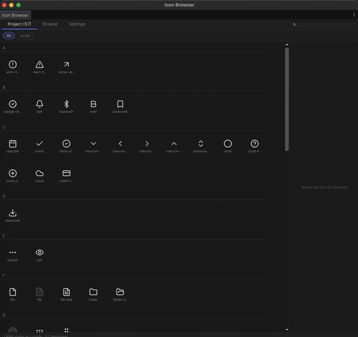
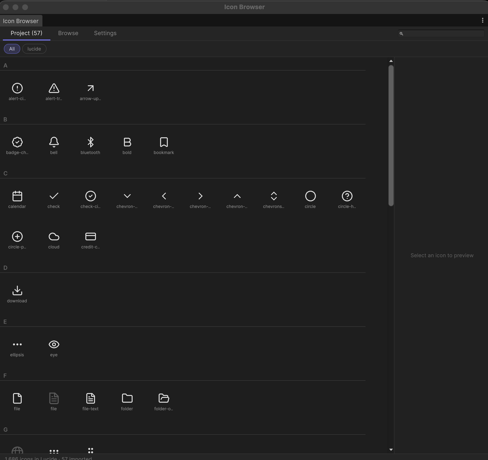
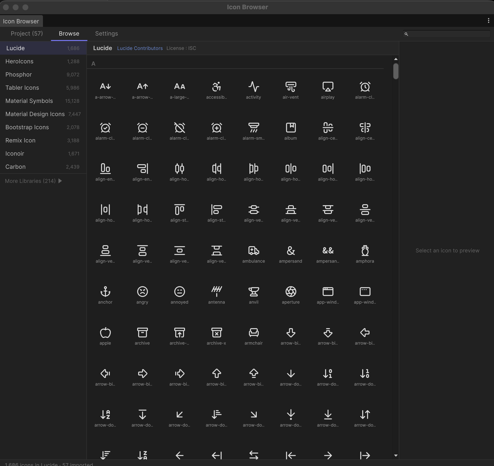

# Icon Browser for Unity

Search, preview, and import **200,000+ open-source icons** from [Iconify](https://iconify.design) directly into your Unity project.




| Project Tab | Browse Tab |
|:-----------:|:----------:|
|  |  |

## Features

- **Browse** 150+ icon libraries (Lucide, Material Symbols, Heroicons, Phosphor, Tabler, Bootstrap Icons, etc.)
- **Search** across libraries with real-time preview
- **Variant grouping** — view bold/fill/outline variants side-by-side
- **Category filtering** for organized browsing
- **One-click import** as SVG VectorImage (resolution-independent)
- **Batch import/delete** with cancelable progress
- **Project tab** for managing imported icons with library filter
- **Atlas-based preview cache** for instant loading across sessions
- **Prefix subfolder** storage to prevent name collisions between libraries
- **`Resources.Load` ready** — imported icons are immediately usable in code

## Requirements

- **Unity 6000.0** (Unity 6) or later — SVG support is built-in

## Installation

### Option 1: Git URL (recommended)

1. Open **Window > Package Manager**
2. Click **+** > **Add package from git URL...**
3. Enter:
   ```
   https://github.com/NewMassMedia/unity-icon-browser.git
   ```

### Option 2: Local

1. Clone or download this repository
2. Open **Window > Package Manager**
3. Click **+** > **Add package from disk...**
4. Select the `package.json` file

## Usage

### Open the browser

**Tools > Icon Browser**

### Browse tab

1. Select a library from the left sidebar
2. Browse icons or use the search bar
3. Click an icon to see details, then click **Import**
4. Or select multiple icons and use **Batch Import**

### Project tab

- View all imported icons in your project
- Filter by library using the pill buttons
- Select and batch delete icons you no longer need

### Use in code

```csharp
var icon = Resources.Load<VectorImage>("Icons/lucide/check");
```

The resource path is shown in the detail panel when you select an imported icon.

### Settings

- **Import Path** — where icons are saved (default: `Assets/CoreUI/Runtime/Resources/Icons`)
- **Filter Mode / Sample Count** — SVG import quality settings
- **Cache** — open or clear the preview atlas cache

## How it works

1. Icons are fetched from the [Iconify API](https://api.iconify.design) (no API key needed)
2. SVG is converted for Unity compatibility (`currentColor` replaced, dimensions normalized)
3. Imported as `VectorImage` via Unity's SVG importer — fully resolution-independent
4. Preview thumbnails are packed into sprite atlases cached in `LocalApplicationData/IconBrowser`

## Icon licenses

Each icon library has its own license (MIT, Apache 2.0, etc.). The license is displayed in the Browse tab info bar. This tool does **not** redistribute any icons — they are downloaded on demand from Iconify's public API.

## License

[MIT](LICENSE)
